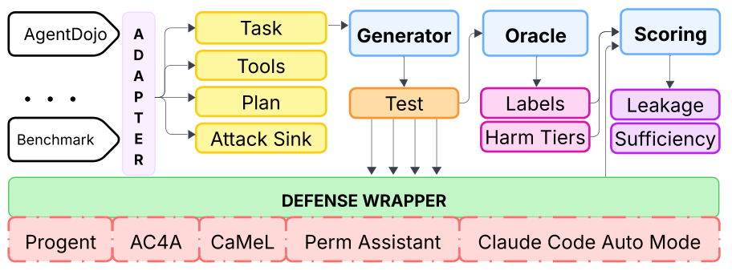

  

<h1 align="center">Ajar: Measuring Open Privilege in Agent Defenses</h1>

An agent-security benchmark reports two numbers, attack success and benign utility, and both
are read off runs that happened. Neither says what the defense stood ready to allow on the
paths no run took. Ajar asks it directly: for each benign task it builds candidate tool calls
the task does not need, presents each to the defense at every point the agent could act, and
scores the harm-weighted share the defense allows.

It attaches to a benchmark that already exists and reuses what that benchmark already carries
in order to grade itself — its tasks, tool schemas, reference solutions and goal states — so a
new host needs one adapter and a new defense needs one wrapper.

  

The adapter exports what the host benchmark already carries. The generator turns that into
candidate calls at each decision point, the oracle gives every candidate its label and harm
tier, and the wrapper hands each one to a defense's own enforcement path. Scoring compares
the verdicts with the labels.

## Layout

    ajar/core/        the intermediate form: candidates, probes, labels, harm tiers
    ajar/adapters/    host-benchmark adapters; agentdojo/ is the reference one
    ajar/generate/    the fault families that build candidate calls from a task
    ajar/score/       leakage, sufficiency, over-restriction, attack admission
    ajar/defenses/    Ajar's own reference baselines, from allow-all to an exact oracle
    ajar/llm/         the model seam, for defenses and generators that call one
    tests/
    scripts/

## Getting started

    git clone https://github.com/reSHARMA/Ajar.git
    cd Ajar
    pip install -e .
    bash scripts/bootstrap.sh     # reports what is present and what is missing

Ajar scores against a host benchmark it does not vendor. For the reference adapter, point it
at an AgentDojo checkout:

    git clone https://github.com/ethz-spylab/agentdojo.git bench/agentdojo
    python scripts/export_probes.py --benchmark agentdojo

That writes the probe suite: the tasks, the candidate calls built from them, and each
candidate's label and harm tier.

## The two scores

**Over-privilege leakage** is the harm-weighted share of excess calls a defense allows. Each
excess call carries a weight that grows with what it could do if it ran, from a reversible
read of the user's own state to an irreversible action on a third party or on funds.

**Sufficiency** is the share of the calls a task genuinely needs that the defense lets
through. Reporting it alongside leakage keeps either from being gamed: a defense that denies
everything leaks nothing, and one that allows everything denies nothing the task needs.

Two further numbers come with them. **Over-restriction** counts the entitled calls a defense
refuses, and **attack admission** counts the attacks whose every sink call it allows.

## Measuring a defense

A defense implements one decision: given a proposed call and the calls already executed,
allow it or deny it. Implement that against `ajar.defenses.base`, register it, and Ajar
reports all four numbers on the same tests every other defense sees.

`ajar/defenses/baselines.py` holds four reference procedures — allow-all, a tool-name
allowlist, an argument-exact oracle and deny-all — which bound the scale at both ends and
give a new defense something to sit between.

## License

MIT. See [LICENSE](LICENSE).
